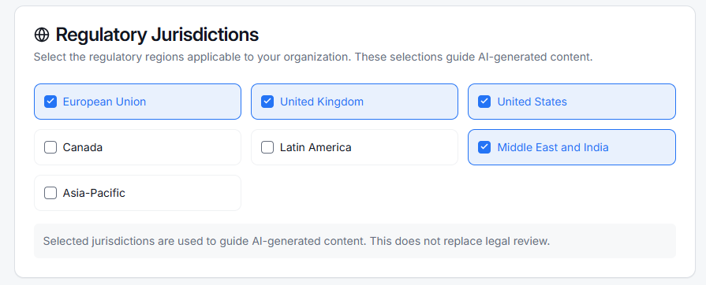

# Settings

Settings allow administrators to configure tenant-level preferences and operational defaults.

This includes:

* organizational metadata
* workflow preferences
* feature-level configurations
* Risk tolerances by department
* Risk review cycles
* Regulatory jurisdictions

<figure><figcaption></figcaption></figure>

* Risk Review cycles are configurable&#x20;

<figure><figcaption></figcaption></figure>

* Select Regulatory Jurisdictions

<figure><figcaption></figcaption></figure>
