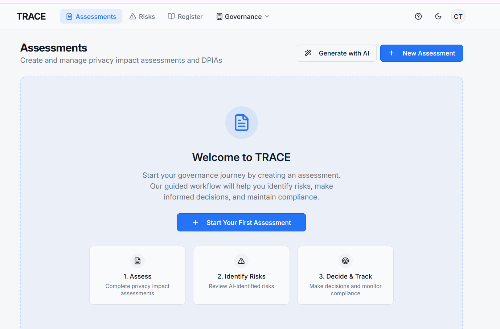

# Creating an Assessment

Creating an assessment in TRACE establishes the **formal starting point** for governance, risk, and compliance workflows.

Assessments are used to document relevant facts, context, and considerations about a system, vendor, process, or activity. Once approved, they serve as the authoritative input for:

* Risk identification
* Decision-making
* Mitigation planning
* Audit and regulatory evidence

No downstream decisions in TRACE occur without an assessment.

### When to Create an Assessment

Users typically create an assessment when:

* Evaluating a new system, product, or vendor
* Making material changes to an existing system
* Conducting privacy, security, or AI governance reviews
* Preparing for audits or regulatory inquiries
* Reviewing contractual or data processing obligations

Assessments may be updated over time, but each version follows the same controlled workflow.

### How to Create an Assessment

#### Step 1: Navigate to Assessments

From the TRACE dashboard, navigate to the **Assessments** area and select **Create Assessment**

<figure><figcaption></figcaption></figure>

#### Step 2: Select an Assessment Type

Choose the appropriate assessment template based on your use case, such as:

* Privacy impact assessment
* AI system assessment
* Article 30 Assessment
* CCPA Risk Assessment

Templates ensure assessments are structured consistently and aligned to governance expectations.

<figure><figcaption></figcaption></figure>

#### Step 3: Provide Basic Context

Enter high-level details such as:

* Assessment name
* Description or scope
* Relevant system, process, or vendor
* Owner or responsible party

This information helps reviewers understand the purpose and boundaries of the assessment.

#### Step 4: Complete Assessment Sections

Assessments are completed using structured sections designed to capture:

* Factual information
* Risk-relevant context
* Operational and organizational details

Users may complete sections manually or use AI assistance where available.

AI assistance is optional and clearly labeled. All AI-assisted activity is logged.

#### Step 5: Save as Draft

Assessments are saved as **drafts** by default.

Draft assessments:

* Can be edited
* Do not trigger risk identification
* Do not create decision records
* Are not considered finalized or approved

This allows users to collaborate and refine content before review.

### What TRACE Records

When an assessment is created, TRACE automatically records:

* The user who created the assessment
* The assessment type and scope
* Draft status and version history
* Timestamps for creation and updates

If AI is used during drafting, corresponding **AI audit log entries** are created.

When an assessment is created, TRACE automatically records:

* The user who created the assessment
* The assessment type and scope
* Draft status and version history
* Timestamps for creation and updates

If AI is used during drafting, corresponding **AI audit log entries** are created.

### What Happens Next

After completing an assessment:

1. The assessment is reviewed for completeness
2. The assessment is submitted for approval
3. Approved assessments may trigger risk identification workflows
